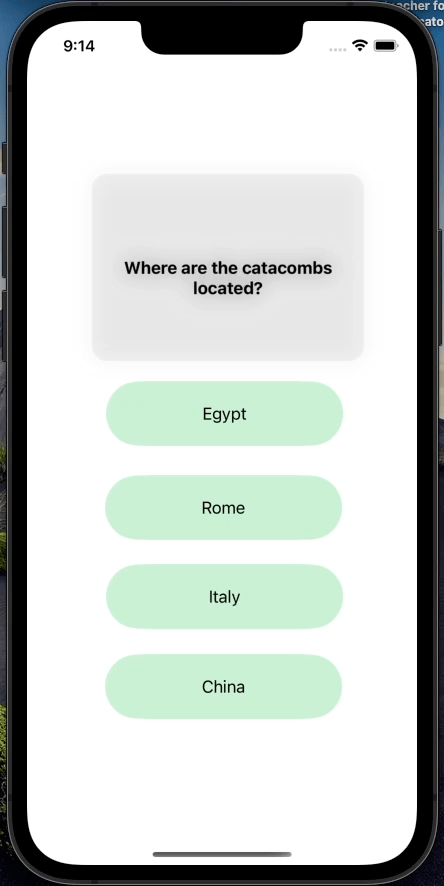

## Lab 3

### App Description
Allows users to go back to previously create flashcards

### App Walk-though

## Required
- [x] User can browse through multiple flashcards
- [ ] User can re-open the app and see previously created flashcards
- [x] Push code to GitHub
## Optional
- [ ] User can delete a flashcard
- [ ] User can edit existing flashcard
- [ ] User can store multiple choice questions

## Lab 2

### App Description
Allows users to create their own flashcards

### App Walk-though

## Required
- [x] User can open the creation screen
- [x] User can cancel out of the creation screen
- [x] User can enter a new question and answer in the creation screen to then show it on the flashcard
- [x] Push code to GitHub
## Optional
- [ ] User gets an error if they try to create a new flashcard with no question or answer
- [ ] User can edit existing flashcard
- [x] User can add multiple choice answers in the creation screen
## FlashCard_App

📝 `NOTE:` Paste the README templates for each subsequent lab here at the top, (i.e. lab 2, 3, 4). This will show a history of your development process including which users stories you completed and how your app looked and functioned at each step.

## Lab 1

### App Description
A simple flashcard review app to stimulate your brain. 

### App Walk-though
`TODO://` Add the URL to your animated app walk-though `gif` in the image tag below. Make sure the gif actually renders and animates when viewing this README. (☝️ Remove this paragraph after after adding gif)

 

## Required
- [x] Create New Project in Xcode
- [x] Add a view for the front side of the flashcard to display the question
- [x] Add a view for the back side of the flashcard to display the answer
- [x] Build in logic to show the answer side when the card is tapped
- [x] Push code to GitHub
## Optional
- [ ] Toggle the flashcard between the question side and the answer side
- [x] Style the question and answer side of the card to better distinguish between the two sides
- [x] Add selectable multiple choice answers beneath the card

